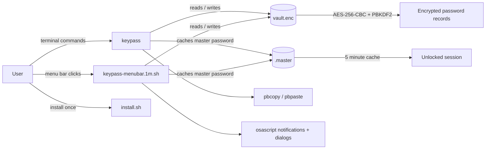

# KeyPass Architecture

KeyPass is a small macOS password manager built from three shell scripts that share one encrypted vault:

- `keypass` handles terminal access, search, copy, add, delete, and listing.
- `keypass-menubar.1m.sh` exposes the same vault in SwiftBar with category grouping.
- `install.sh` adds the CLI entry point to your shell PATH.

## High-level flow



## Runtime components

### CLI: `keypass`

The CLI is the primary automation surface. It:

- prompts for a master password when no cache is present,
- decrypts the vault into a temporary file,
- supports direct copy by number, fuzzy search, list, add, and delete,
- copies secrets to the clipboard with `pbcopy`, and
- clears the clipboard after 30 seconds if the copied secret is still present.

### Menu bar plugin: `keypass-menubar.1m.sh`

The SwiftBar plugin provides a graphical menu bar view. It:

- unlocks the vault with a dialog prompt,
- groups passwords by category when the new `category|name|password` format is present,
- supports both the new and legacy `name|password` record formats,
- uses `osascript` for dialogs and notifications, and
- reuses the same encrypted vault file as the CLI.

### Installer: `install.sh`

The installer adds the repository directory to the user's PATH and creates the shorter `kp` alias for convenience.

## Storage model

KeyPass stores data under:

```text
~/Library/Application Support/KeyPass/
├── vault.enc
└── .master
```

- `vault.enc` contains the encrypted vault contents.
- `.master` is a short-lived cache of the master password with a 5 minute TTL.

## Record formats

The vault supports two plain-text record layouts before encryption:

- Legacy CLI format: `name|password`
- Menu bar format: `category|name|password`

The menu bar treats old records as `Uncategorized` so both formats can coexist.

## Security notes

- Encryption uses `openssl enc -aes-256-cbc -salt -pbkdf2 -iter 100000`.
- The vault directory is created with `700` permissions.
- The vault file and cached master password are written with `600` permissions.
- Clipboard clearing is best-effort and only clears the clipboard if the copied secret is still current.

## Request lifecycle

1. User invokes the CLI or clicks the menu bar item.
2. KeyPass loads or prompts for the master password.
3. The vault is decrypted into a temporary working file.
4. The requested operation is executed.
5. The vault is re-encrypted if it changed.
6. Temporary files are removed on exit.
